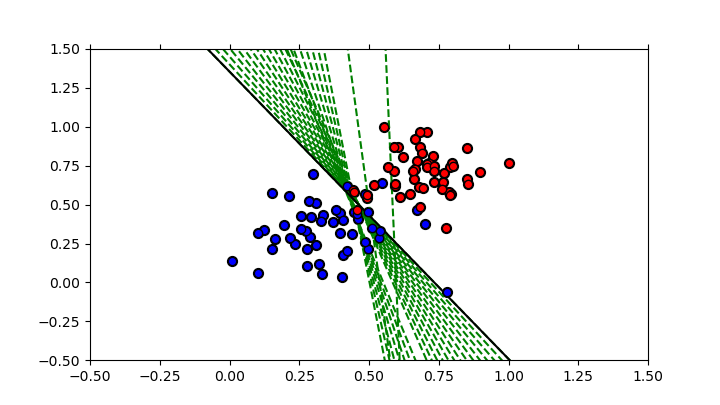

# Perceptron trick

Exercise of the Udacity course  [Intro to Deep Learning with PyTorch](https://learn.udacity.com/courses/ud188. 
The perceptron trick is a tiny step that helps us go from a classifier, to a slightly better classifier.

The script produces the  figure, which illustrates the evolution of the lite to split the data groups at each epoch. 